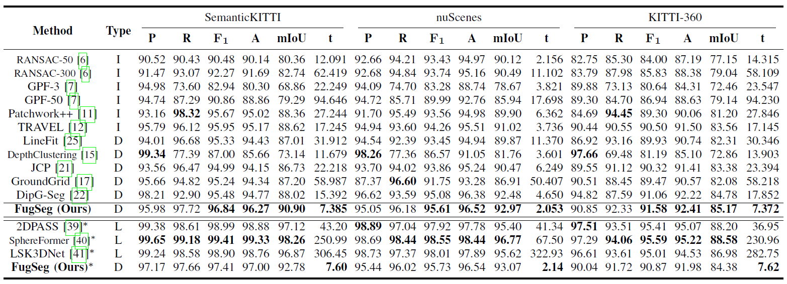
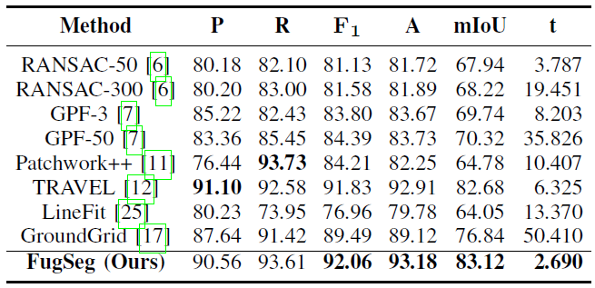

# FugSeg: Fast Uncertainty-Aware Ground Segmentation for 3-D Point Cloud

This repository hosts the official implementation of [FugSeg](https://doi.org/10.1109/TITS.2026.3682176).

FugSeg is a fast uncertainty-aware method for ground segmentation in 3D point clouds, designed to address reflection noise and isolated/occluded ground regions. It uses a **polar grid map** for cross-LiDAR generalizability, a **within- and cross-segment labeling strategy**, and an **adaptive slope** that incorporates measurement uncertainties. Point-level segmentation is achieved through **fine-grained ground elevation estimation**, while reflection noise is explicitly handled through noisy ground cells. On four public benchmarks (SemanticKITTI, nuScenes, KITTI-360, LiDARDustX), FugSeg achieves the highest F1, accuracy, and mIoU among non-learning methods, running at **135 Hz / 487 Hz** for 64- and 32-layer LiDARs on a single CPU thread.

<p align="center">FugSeg on the SemanticKITTI and nuScenes datasets</p>
<p align="center">
  
</p>

<p align="center">Table 1: Performance of FugSeg on the SemanticKITTI, nuScenes and KITTI-360 datasets</p>
<p align="center">
	
</p>

<p align="center">Table 2: Performance of FugSeg on the LiDARDustX dataset</p>
<p align="center">
	
</p>

## Publication

- Official publication (IEEE TITS, 2026): https://doi.org/10.1109/TITS.2026.3682176
- Preprint (arXiv): https://doi.org/10.48550/arXiv.2605.08952

## Environment Setup

By design, FugSeg (`src/fugseg`) is implemented as a pure CMake project, which uses `Eigen3` and `Boost.Filesystem` for non-algorithmic operations. On the Ubuntu OS, these dependencies can be installed via:
```
sudo apt install libeigen3-dev
sudo apt install libboost-system-dev libboost-filesystem-dev
```

To visualize the ground segmentation result, we implement a ROS1 node `viewer` in `src/ros_node`. `viewer` uses RViz for 3D rendering, and the corresponding launch and configuration files are provided under `src/ros_node/launch`. ROS1 (Melodic or Noetic) is required to build and run this visualization node.

This project has been tested under the following configurations:
```
Ubuntu 18.04 + ROS Melodic
Ubuntu 20.04 + ROS Noetic
```

To use FugSeg (`src/fugseg`) without ROS, integrate it as a regular CMake subdirectory in your own project and link the same dependencies (`Eigen3`, `Boost.Filesystem`). The package currently includes catkin declarations, so ROS-free integration requires minor CMake cleanup in `src/fugseg/CMakeLists.txt`. The resulting `CMakeLists.txt` may look like:
```
cmake_minimum_required(VERSION 3.12)
project(fugseg)
set(CMAKE_BUILD_TYPE "Release")
find_package(Eigen3 REQUIRED)
find_package(Boost REQUIRED)
include_directories(include)
add_library(fugseg
    src/fugseg.cpp
    src/dataset.cpp
    src/cloud.cpp
    src/utils.cpp
)
target_link_libraries(fugseg
    Eigen3::Eigen
    ${Boost_LIBRARIES}
)
```

## Build

As both `src/fugseg` and `src/ros_node` are catkin packages, one can build this project by:
```
git clone https://github.com/Leo-YuLi/FugSeg.git
cd FugSeg
catkin_make
```

## Run

Once the build is complete, a `viewer` node is generated under the catkin package `fugseg_node`. To run this node, one should first source the `setup.sh` file under `devel/`:
```
source devel/setup.sh
```
Then, in the same terminal window, launch the ROS1 node `viewer` via:
```
roslaunch fugseg_node viewer.launch
```
Note that you may need to adjust the `glb_lidar_dir` parameter in `viewer.launch` to the actual KITTI/SemanticKITTI dataset directory. Currently, only the KITTI/SemanticKITTI configuration is integrated.

To adapt the pipeline to other datasets/sensors, update the sensor-dependent implementations/settings in `fugseg::KITTI` and `fugseg::GroundExtractor`, including:
- File parsing and frame conventions used by the dataset
- Sensor-specific parameters such as the angular and ranging accuracy, the installation height, and the bounding box of ego reflections 

## Further Visual Results

FugSeg on the KITTI-360 dataset:<br>


FugSeg on the LiDARDustX dataset:<br>


FugSeg on the OS1-128 LiDAR sensor:<br>


FugSeg on the VLP-32C LiDAR sensor:<br>


## License

This project is licensed under the MIT License. See LICENSE for details.

## Citation

Please cite our publication if you use this code:
```
@ARTICLE{li2026fugseg,
  author={Li, Yu and Schwieger, Volker},
  journal={IEEE Transactions on Intelligent Transportation Systems},
  title={FugSeg: Fast Uncertainty-Aware Ground Segmentation for 3-D Point Cloud},
  year={2026},
  pages={1-14},
  doi={10.1109/TITS.2026.3682176}
}
```

## Contribution

Bug reports and suggestions are welcome through GitHub Issues. Pull requests are also welcome for fixes and improvements.
